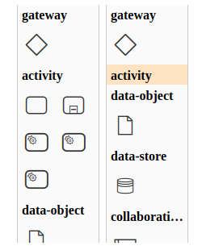

> > This example is part of our [:notebook: custom elements guide](https://github.com/bpmn-io/bpmn-js-examples/tree/master/custom-elements). Checkout the final result [here](https://github.com/bpmn-io/bpmn-js-example-custom-elements).


# bpmn-js Example: Custom Controls

An example of creating custom editing controls for [bpmn-js](https://github.com/bpmn-io/bpmn-js). Use this blueprint to suite the BPMN modeler to your specific needs.


## About

This example adds controls that allow you to create `bpmn:ServiceTask` elements through the palette and the context pad.



### Creating Custom Controls

First, let's add the ability to create `bpmn:ServiceTask` elements through the [palette](https://github.com/bpmn-io/diagram-js/blob/master/lib/features/palette/Palette.js). We'll create a new module that will register itself with the palette as a provider for entries. We don't need to override the existing provider since we want to keep the existing entries. Our provider implements a `getPaletteEntries` method that returns a single entry:

```javascript
getPaletteEntries(element) {
    const {
      create,
      elementFactory,
      translate
    } = this;

    function createServiceTask(event) {
      const shape = elementFactory.createShape({ type: 'bpmn:ServiceTask' });

      create.start(event, shape);
    }

    return {
      'create.service-task': {
        group: 'activity',
        className: 'bpmn-icon-service-task',
        title: translate('Create ServiceTask'),
        action: {
          dragstart: createServiceTask,
          click: createServiceTask
        }
      }
    }
  }
```

You can use the `group` property to group multiple entries. In this case, we're adding our entry to an existing group. Using the `className` property, you can style your entry through CSS. We're using a class that is part of [bpmn-font](https://github.com/bpmn-io/bpmn-font), so there will be a service task icon in the palette. Using the `action` property, we decide what happens when the user clicks or drags the icon.

See the entire palette [here](app/custom/CustomPalette.js).

Now, let's also add the ability to create `bpmn:ServiceTask` elements through the [context-pad](https://github.com/bpmn-io/diagram-js/blob/master/lib/features/context-pad/ContextPad.js):

```javascript
'append.service-task': {
  group: 'model',
  className: 'bpmn-icon-service-task',
  title: translate('Append ServiceTask'),
  action: {
    click: appendServiceTask,
    dragstart: appendServiceTaskStart
  }
}
```

See the entire context pad [here](app/custom/CustomContextPad.js).

Next, let's add our custom controls to bpmn-js.

### Adding the Custom Controls to bpmn-js

When creating a new instance of bpmn-js we need to add our custom controls using the `additionalModules` property:

```javascript
import BpmnModeler from 'bpmn-js/lib/Modeler';

import customControlsModule from './custom';

const bpmnModeler = new BpmnModeler({
  additionalModules: [
    customControlsModule
  ]
});
```

Our custom controls will now be added to bpmn-js.

## Run the Example

You need a [NodeJS](http://nodejs.org) development stack with [npm](https://npmjs.org) installed to build the project.

To install all project dependencies execute

```sh
npm install
```

To start the example execute

```sh
npm start
```

To build the example into the `public` folder execute

```sh
npm run all
```


## License

MIT
